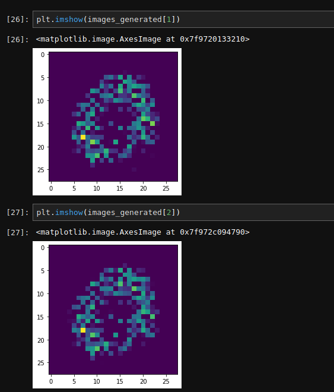
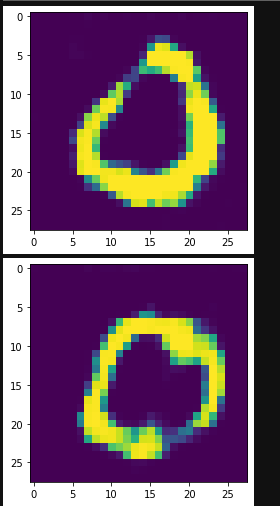

# GAN-VS-DCGAN
Overcoming the drawbacks of the GAN(Generative Adversarial Network) by deploying DCGAN(Deep Convolutional Generative Adversarial Network ) 

## About

[GAN](https://github.com/varunsly/GAN-VS-DCGAN/blob/master/GAN.ipynb) model, I made is able to make fake image of the real image to a extent.
But the due to **Mode Collapse** the image fake image formed by the **Generator** is able to fool the **Discriminator**. Due to which the fake image produced is not that good.

***Original Image***

***Fake Image GAN***

***To Overcome the Mode Collapse, I used DCGAN***

[DCGAN](https://github.com/varunsly/GAN-VS-DCGAN/blob/master/DCGAN.ipynb) model, I made is able to produce the fake image very similar to the real image. And the images produced by the **Generator** are all different from each other which shows it is able to over come the **Mode Collapse** problem which presist in GAN model.

***Original Image***

***Fake Image DCGAN***

